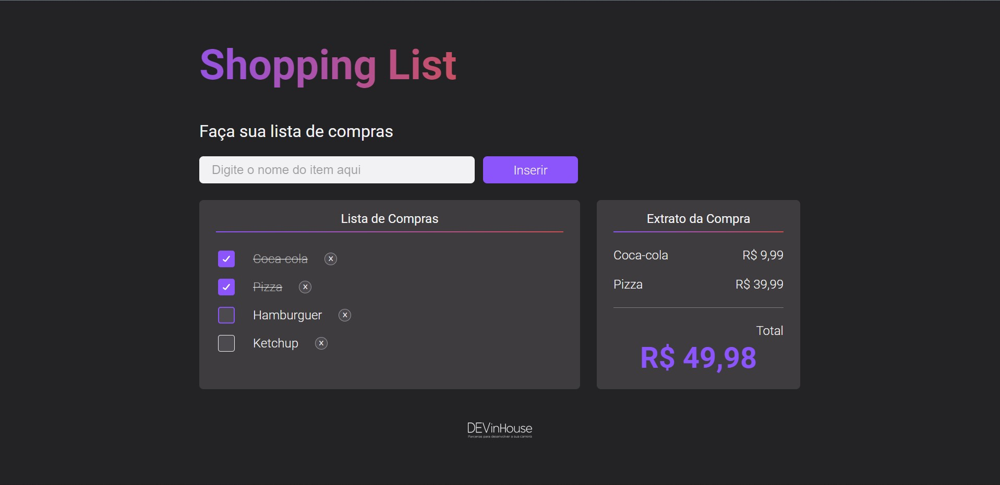
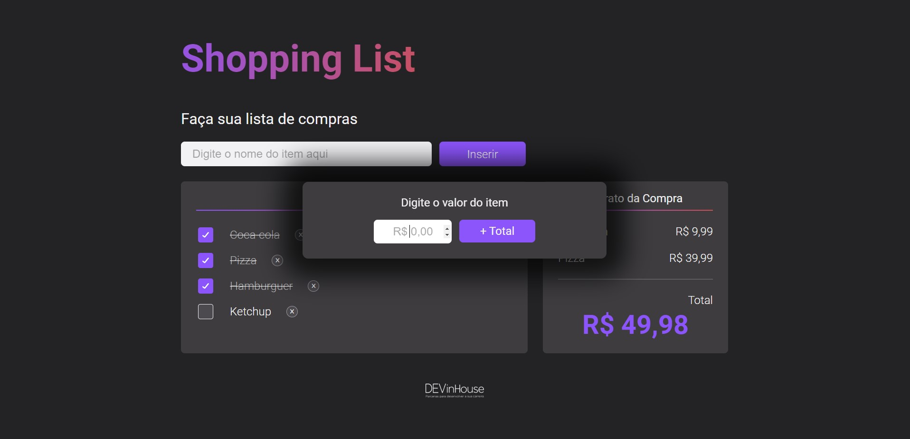
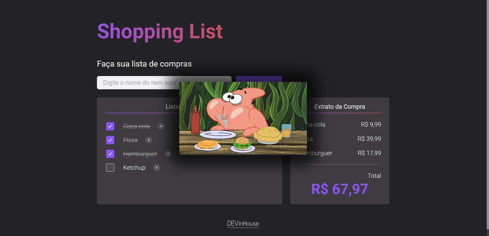

# DevInHouse - Módulo 1 - Projeto 1

## Módulo1 - Projeto 1: Criação de uma aplicação web para controle e cálculo de uma lista de compras

### REQUISITOS DA APLICAÇÃO

  1. Um título na aba do navegador, para que o usuário encontre a sua aplicação no meio das várias abas que constantemente mantém abertas.
  2. Um cabeçalho dentro da página, para que o usuário saiba facilmente em que página se encontra e do que se trata o conteúdo.
  3. Um campo de texto para digitar o nome do produto a ser adicionado à lista.
  4. Um botão para adicionar um novo produto na lista.
  5. Uma lista contendo os produtos já inseridos.
  6. Cada linha da lista deve conter: checkbox para o usuário marcar aquele produto que já foi comprado; o texto que o usuário digitou ao cadastrar a atividade; botão para excluir o produto da lista, caso desejado.
  7. Quando o usuário marcar um item da compra, deve-se abrir um pop-up para que o usuário digite o valor da compra, após isso, deve-se somar ao valor total das compras.
  8. A lista deve ser salva no "localStorage" do navegador (incluindo os produtos que já foram realizados), e deve ser carregada sempre que a página for reaberta.
  9. BÔNUS:  A Fim de trazer elementos externos de forma dinâmica para nossa aplicação, você pode opcionalmente  utilizar a API https://api.giphy.com/v1/gifs/search?api_key=dpPu1kIHwa3fxoQiH9lzTfmUkMgEjtuS&q=hamburguer para criar uma experiencia customizada para o usuário.
     * a. O termo “hamburguer” deve ser substituído pelo item  adicionado, assim a api fornecerá diversos gifs que podem ser exibidos para o usuário com você achar melhor.
     * b.Este item concede um ponto extra, mas não altera o limite de pontos!
  

### Exemplo de Aplicação

  

### Plano do Projeto
Ao construir uma aplicação de Lista de compras salvando os dados no LocalStorage do navegador, o aluno estará colocando em prática os aprendizados em:
* HTML: principais tags como head, meta, title, body, div, h1, form, input, button, ul, li. Atributos de tags como class, id, type. Inclusão de arquivos de estilos (css) e de script (js) na página.
* CSS: estilizar a página, os botões, inputs, alterar atributos dos elementos da tela de acordo com a interação do usuário para uma melhor experiência do usuário (UX).
* Javascript: variáveis, arrays, funções, manipulação do DOM (eventos, elementos e seus atributos), manipular objetos (JSON), utilizar o localStorage.
  

